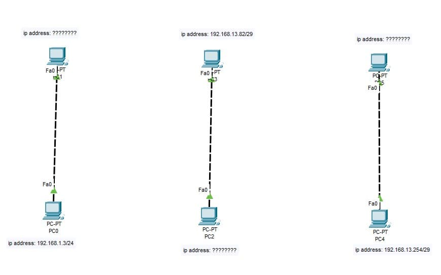
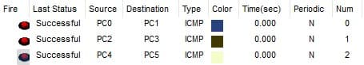

### Exercise 1:

In your `Cisco PacketTracer` create this network:

- `PC0` can communicate with `PC1`.
- `PC2` can communicate with `PC3`.
- `PC4` can communicate with `PC5`.

**Knowledge:**

- What is RJ-45 cable?
- Understand what is the difference between straight through and crossover RJ-45 cables.

### **Solution**

[Solution file](ex01.pkt)

  - **Construction steps**:
    - Added 6 End Devices (PCs)
    - Connected them in pairs with copper crossover RJ-45 cables from FastEthernet0 slots.
    - Configured each pairs missing PC IPs by looking at the given IPs which were represented using the CIDR notation.
    - Added labels for better readability.

  - **Theory**: 
    - Registered Jack-45 (RJ-45) is a eight-pin standardized network connector used for connecting devices to a Local Area Network (LAN) or the Internet. They are usually made out of copper.
      
     - The main differences between straight through and crossover RJ-45 are:
         - Wiring configuration
         - Use case: straight through is used to connect different devices (PC and a Router fe), whereas crossover is used to connect similar devices (PC to PC)
      
