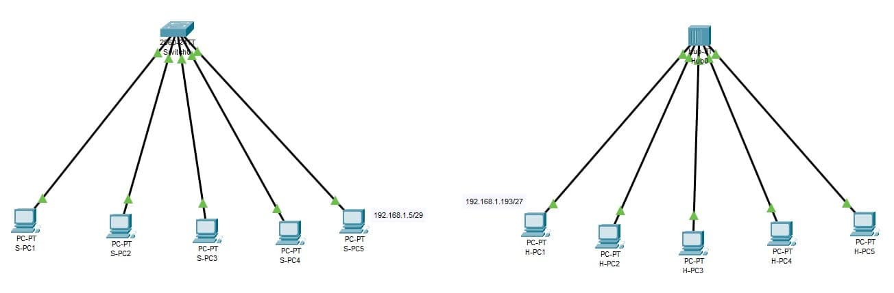
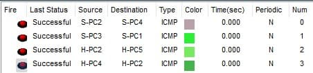

### Exercise 2:

In your `Cisco PacketTracer` create this network:

- All computers connected to the Switch must be connected.
- All computers connected to the Hub must be connected.

**Knowledge:**

- Understand the function of a `switch` and a `hub`, how they operate and their role in networking.
- Differentiate between the `switch` and the `hub`.
- Identify the `OSI model layer` that the `switch` and `hub` operate on.

### **Solution**

[Solution file](./ex02.pkt)

**Construction steps**:
- Added 2 networks: 6PC + Switch && 6PC + Hub
- Connected end devices with straight through copper RJ-45.
- Configured all end devices IPs from given IP addresses.
- Added labels for better readability

**Theory**: 
- Switch is a more advanced networking device which provides a smarter and more efficient way of connecting devices within network. They create individual communication channels between devices, allowing them to send/recieve data independently. 
        
- Hub is a basic networking device which provides a simple connection between other devices. It acts as a multiport reciever meaning it will broadcast every message to all of the connections, even when that was not the indent.
        
- The main difference between a hub and switch is that a hub is not able to have individual communication between devices while a switch is.
        
- The switch operates at the data link layer (layer 2) and the hub operates at the physical layer (layer 1) of the OSI model.
