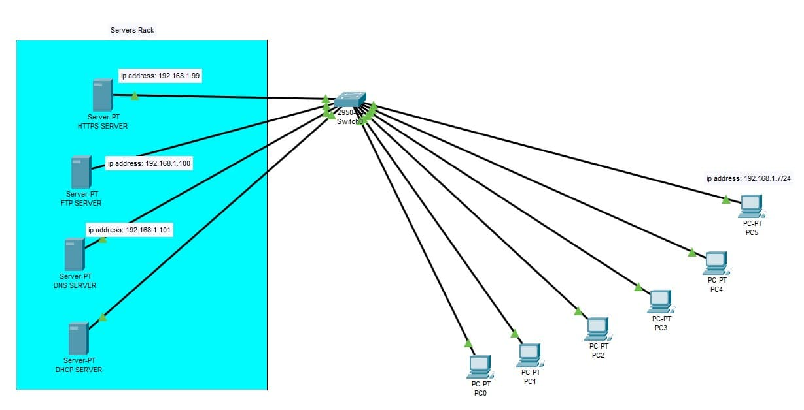

### Exercise 3:

In your `Cisco PacketTracer` create this network:



- Static IP addresses are mandatory for all servers.
- Services provided by each server should be limited to their designated purpose.
- The `DHCP server` must be responsible for assigning IP addresses to all PCs.
- The `HTTPS server` must display a hello message and `HTTP` must be disabled.


- You must create a user account with the name "deepinnet" and provide `RWDNL` access on your `FTP server`.


- Configure the following records in your `DNS server`:

  - Map "deep-in-net.local" to IP address 192.168.1.99.
  - Map "deep-in-net.com" to "deep-in-net.local".

```bash
deep-in-net.local > 192.168.1.99
deep-in-net.com > deep-in-net.local
```

- Ensure that "https://deep-in-net.com" redirects to your `HTTPS server`.


**Knowledge:**

- Define a `server` and its purpose in networking.
- Explain `DHCP` and how it operates in a network.
- Define `DNS` and its role in network communication.
- Understand the purpose of `HTTP` and how it is used in networking.
- Explain `HTTPS` and how it is different from `HTTP`.
- Understand the purpose of `FTP` and how it operates in network communication.
- Define `TCP` and `UDP` communication and differentiate between them.
- Identify the `OSI model layer` where `TCP` and `UDP` operate.
- Define a `port` in networking and its function.
- Identify the `port` and `OSI model layer` for each protocol used.
- Understand the different types of `DNS` records.

- ### **Solution**

  [Solution file](ex03.pkt)

  - **Construction steps**:
    - Added server rack
    - Assigned static IPs to every server
    - Renamed servers
    - Enabled only the needed services
    - Added a switch
    - Added 6x end devices (PC)
    - Added labels for better readability
    - Connect everything to the switch using straight through copper RJ-45 cabel
    - Configure DHCP server to assign IPs from 192.168.1.1 to 192.168.255.254 on a subnet mask of 255.255.255.0.
    - Enable DHCP on all end devices
    - Edit index.html file in the HTTPS server to display the required html
    - Create an user deepinnet with a pwd of password123 with RWDNL permissions.
    - In DNS server, mapped deep-in-net.com to deep-in-net.local using CNAME type and deep-in-net.local to 192.168.1.99 (HTTPS server) using A Record.

  - **Theory**: 
    - A server is a specialized computer or software application that provides specific services or resources to other computers, devices, or users in a network.  Their role spans from resource sharing, data storage, and communication services to managing authentication, security, and other critical functions within the network environment.
    <br><br>
    - DHCP (Dynamic Host Configuration Protocol) is a network protocol used to automatically assign IP addresses and other network configuration parameters to devices on a local area network (LAN). When a device joins the network, it requests an IP address from the DHCP server. The server provides an available IP address and other settings, simplifying network setup and management. DHCP ensures efficient IP address allocation and central configuration control, making it essential for modern networks.
    <br><br>
    - DNS stands for Domain Name System. It is a fundamental protocol used in network communication to convert human-readable domain names (like www.example.com) into numerical IP addresses (like 192.0.2.1) that computers use to identify and communicate with each other over the internet.
    <br><br>
    - HTTP stands for Hypertext Transfer Protocol. It is a protocol used in networking and the foundation of data communication for the World Wide Web. The primary purpose of HTTP is to facilitate the transfer of data (text, images, video, etc.) between a web server and a web browser, enabling users to access and interact with web pages and web-based applications.
    <br><br>
    - HTTPS stands for Hypertext Transfer Protocol Secure. It is a secure version of HTTP that adds an extra layer of security by encrypting the data exchanged between the web browser and the server. This encryption protects sensitive information, such as login credentials, personal data, and financial transactions, from being intercepted and read by unauthorized parties.
    <br><br>
    - FTP stands for File Transfer Protocol. It is a standard network protocol used to transfer files between a client (such as a computer) and a server over a network, typically the internet. The primary purpose of FTP is to facilitate file sharing and management, enabling users to upload, download, and manipulate files on remote servers. FTP follows a client-server architecture. The client initiates the connection to the server to perform file operations.
    <br><br>
    - TCP and UDP are two primary transport layer protocols used for communication in computer networks. TCP is connection-oriented, meaning it establishes a reliable and ordered connection between sender and receiver before data exchange. UDP is connectionless, and data packets are sent without establishing a dedicated connection, making it faster but less reliable.
    <br><br>
    - TCP and UDP operate at the Transport Layer (Layer 4) of the OSI model, responsible for end-to-end communication and error recovery.
    <br><br>
    - In networking, a port is a virtual address used to identify specific processes or services running on a networked device. Ports enable multiple applications or services to share a single IP address on a device, allowing for simultaneous network communication. Example: HTTP uses TCP port 80, HTTPS uses TCP port 443, DNS uses UDP port 53.
    <br><br>
    - Types of DNS records:
        - A Record: Maps domain to IPv4 address.
        - AAAA Record: Maps domain to IPv6 address.
        - CNAME Record: Creates alias for another domain.
        - MX Record: Specifies mail server for a domain.
        - TXT Record: Stores human-readable text info.
        - NS Record: Identifies authoritative name servers.
        - PTR Record: Maps IP address to domain (used in reverse DNS).
