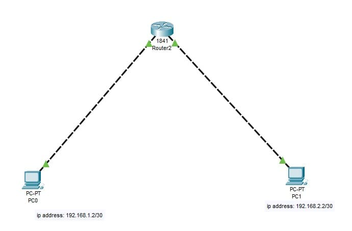
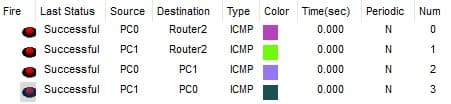

### Exercise 4:

In your `Cisco PacketTracer` create this network:

- Both PCs must communicate with each other.

**Knowledge:**

- What is a `router` and what is its role?
- Differentiate between the switch and the router.
- Identify the `OSI model layer` where a `router` operates.
- Understand the term "default gateway".

- ### **Solution**

    [Solution file](ex04.pkt)

  - **Construction steps**:
    - Added 2 end devices (PC)
    - Added a router
    - Configured end devices IPs with given IPs
    - Configured router FastEthernet0/0 and FastEthernet0/1 to act as gateways to those 2 different subnets
    - Configured both end devices to use router provided IPs as default gateway

  - **Theory**: 
    - A router is a networking device that connects multiple networks together and forwards data packets between them. Its primary role is to determine the best path for data to reach its destination across interconnected networks. Routers operate at the network layer (Layer 3) of the OSI model and are essential for directing traffic efficiently on the internet and complex networks.
      
    - Switches are used to enhance local network performance whereas a routers are used to direct traffic between different networks and decide on the best route. They also operate at a different OSI model layers (2 and 3)
      
    - In networking, the default gateway is a specific network device (often a router) that serves as the exit point for traffic leaving a local network and heading to remote networks or the internet. 
