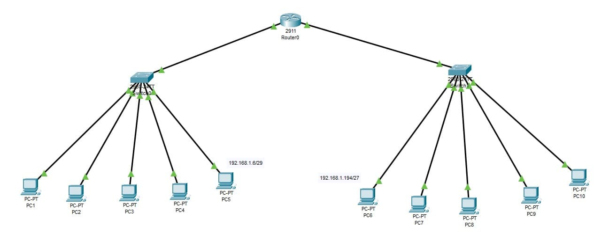

### Exercise 5:

In your `Cisco PacketTracer` create this network:

- All devices connected to the same switch must be able to communicate with each other.
- All devices in `subnet 1` can communicate with all devices in `subnet 2`.
- All devices in `subnet 2` can communicate with all devices in `subnet 1`.

- ### **Solution**

    [Solution file](ex05.pkt)

  - **Construction steps**:
    - Added two subnets: 5 end devices (PC) both subnets connected to switchers which then are connected to a router.
    - Connected everything using straight through copper RJ-45.
    - Switches are connected to router using GigabitEthernet ports.
    - Added IPs to both GigabitEthernet ports.
    - Added default gateways to all end devices.
    - Added labels for better readability.
