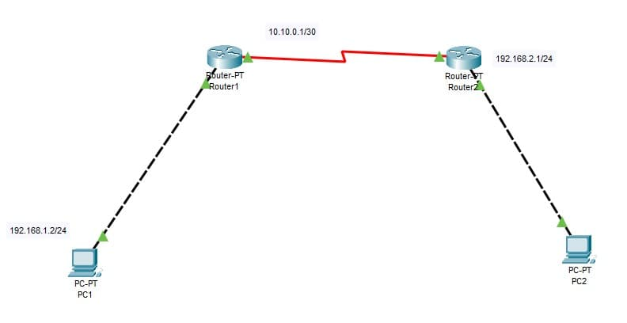
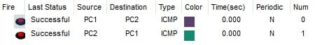

### Exercise 6:

In your `Cisco PacketTracer` create this network:

- The PC in `subnet 1` can communicate with The PC in `subnet 2`.
- The PC in `subnet 2` can communicate with The PC in `subnet 1`.

**Knowledge:**

- What is a routing table and explain its role in routing network traffic.

- ### **Solution**

    [Solution file](ex06.pkt)

  - **Construction steps**:
    - Added to networks: both have 1 end device and routers.
    - Configured the end devices IPs using the given IPs
    - Configured default gateways
    - End devices are connected using crossover copper RJ-45. Routers are connected using Serial DTE cabel.
    - Configured a network between the routers.
    - Added RIP routes in route table to both of the routers.
    - Added labels for better readability

  - **Theory**: 
    - A routing table is a data structure stored within a router that contains information about the paths and next-hop destinations to various networks in the overall network environment. Routers use routing tables to determine the best path for forwarding data packets to their intended destinations. The routing table is a crucial component of a router's decision-making process, as it helps the router make informed choices about where to send data.
