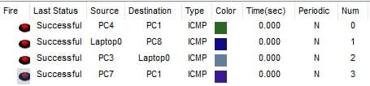

### Exercise 7:

In your `Cisco PacketTracer` create this network:

- All devices connected to the same `switch` must be able to communicate with each other.
- All devices in `subnet 1` can communicate with all devices in `subnet 2`.
- All devices in `subnet 2` can communicate with all devices in `subnet 1`.

- ### **Solution**

    [Solution file](ex07.pkt)

  - **Construction steps**:
    - Added 2 networks: connected with routers
    - Configured all of the end devices IPs
    - Added router gateways
    - Connected using straight through copper RJ-45 and Serial DTE.
    - Added labels for better readability.
