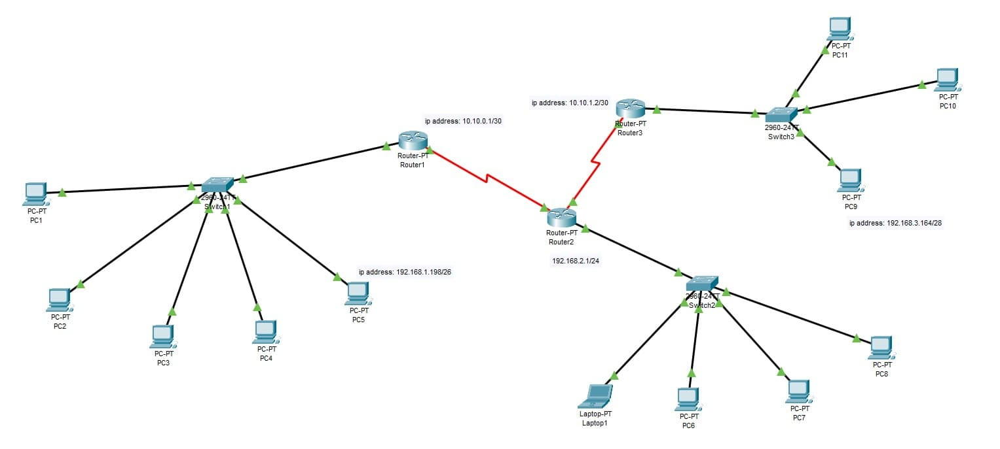

### Exercise 8:

In your `Cisco PacketTracer` create this network:

- All devices connected to the same switch must be able to communicate with each other.
- All devices in `subnet 1` can communicate with all devices in `subnet 2`.
- All devices in `subnet 1` can communicate with all devices in `subnet 3`.
- All devices in `subnet 2` can communicate with all devices in `subnet 1`.
- All devices in `subnet 2` can communicate with all devices in `subnet 3`.
- All devices in `subnet 3` can communicate with all devices in `subnet 1`.
- All devices in `subnet 3` can communicate with all devices in `subnet 2`.

- ### **Solution**

    [Solution file](ex08.pkt)
  - **Construction steps**:
    - Everything I did here has already been described. Here it was just in a bigger scale.